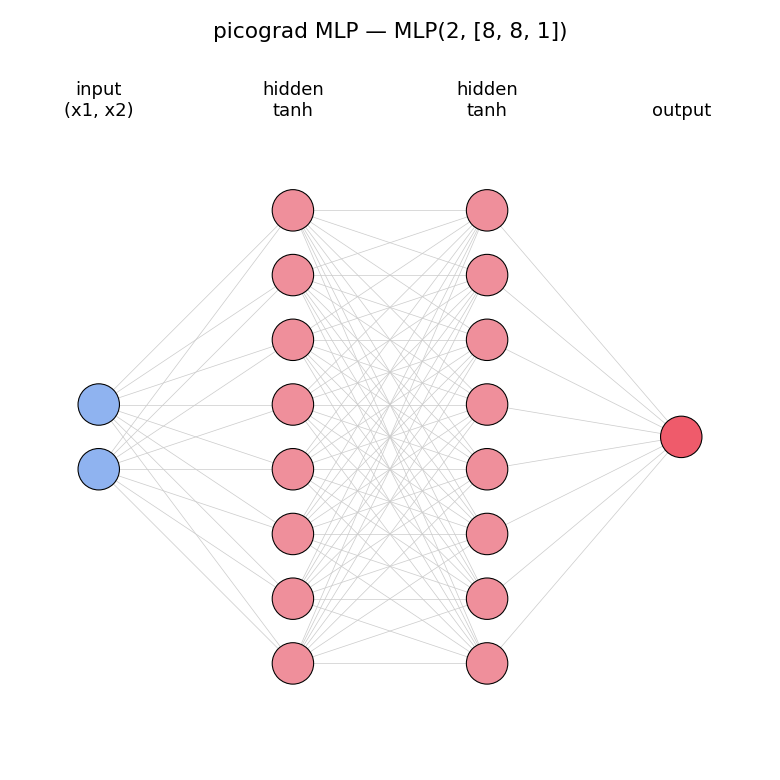
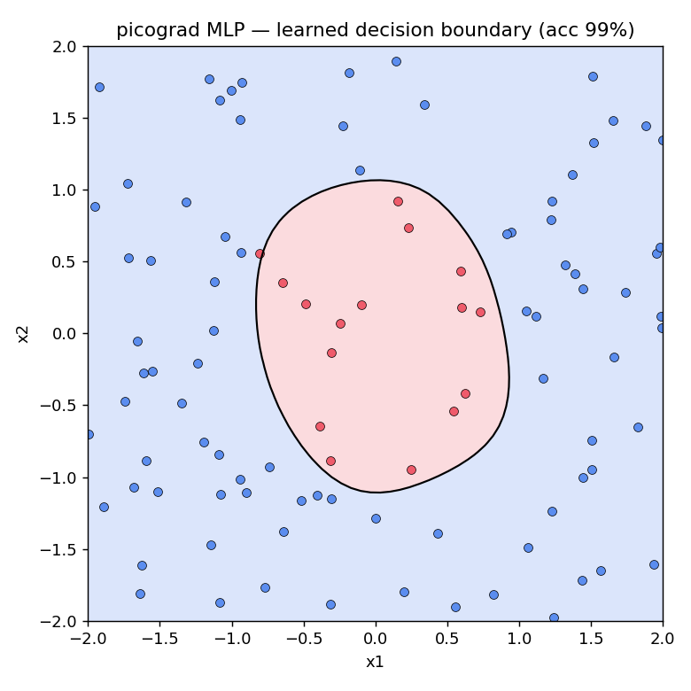

# picograd

A tiny reverse-mode automatic differentiation engine in pure Python.

`picograd` builds a dynamic computation graph over scalar values and backpropagates
gradients through it with the chain rule — the same core mechanism behind PyTorch's
`autograd` and every other deep learning framework. Zero dependencies, a few hundred
lines, fully gradient-checked. Inspired by Andrej Karpathy's
[micrograd](https://github.com/karpathy/micrograd).

<table>
<tr>
<td></td>
<td></td>
</tr>
<tr>
<td align="center"><sub>An MLP built from scalar <code>Value</code>s</sub></td>
<td align="center"><sub>...trained to separate a nonlinear class boundary (99% acc)</sub></td>
</tr>
</table>

Full walkthrough in [`examples/train_mlp.ipynb`](examples/train_mlp.ipynb) — build the
network, train it with gradient descent, and visualize what it learned.

## Install

Install directly from GitHub:

```bash
pip install git+https://github.com/zzkai098/picograd.git
```

Or clone and install in editable mode for development:

```bash
git clone https://github.com/zzkai098/picograd.git
cd picograd
pip install -e .
```

## Quickstart

```python
from picograd import Value

a = Value(2.0)
b = Value(-3.0)
c = Value(10.0)

d = a * b + c        # forward pass builds the graph
d.backward()         # reverse pass fills in every gradient

print(a.grad)        # d(d)/d(a) = b = -3.0
print(b.grad)        # d(d)/d(b) = a =  2.0
```

Gradients flow through arbitrarily deep expressions built from any supported op:

```python
from picograd import Value

x = Value(1.5)
y = Value(-2.0)

z = (x * y + x**2).tanh() * x.exp() - y / x
z.backward()

print(x.grad, y.grad)   # exact analytic gradients
```

### Train a neural net

The `nn` module stacks `Value`s into a small MLP you can train by hand — a compact
version of the training loop behind the figures above:

```python
import random
from picograd import Value
from picograd.nn import MLP

# toy dataset: inside the unit circle -> +1, outside -> -1
random.seed(1)
xs, ys = [], []
for _ in range(60):
    a, b = random.uniform(-2, 2), random.uniform(-2, 2)
    xs.append([a, b]); ys.append(1.0 if a*a + b*b < 1.0 else -1.0)

model = MLP(2, [8, 8, 1], activation='tanh')

for k in range(80):
    ypred = [model(x) for x in xs]
    loss = sum(((y - p)**2 for y, p in zip(ys, ypred)), Value(0.0)) / len(ys)

    model.zero_grad()          # reset gradients (they accumulate)
    loss.backward()            # backprop through the whole network
    for p in model.parameters():
        p.data -= 0.2 * p.grad  # gradient-descent step

    if k % 20 == 0:
        acc = sum((p.data > 0) == (y > 0) for y, p in zip(ys, ypred)) / len(ys)
        print(f"step {k:2d}  loss {loss.data:.3f}  acc {acc:.0%}")
```

See [`examples/train_mlp.ipynb`](examples/train_mlp.ipynb) for the full version with
data generation and decision-boundary plots.

## Features

- Scalar `Value` autograd node with a dynamically-built computation graph
- Full operator set: `+`, `-`, `*`, `/`, `**`, unary negation, and reflected
  ops (`2 * x`, `1 + x`, ...)
- Nonlinearities: `tanh`, `relu`, `exp`
- `backward()` via topological sort with correct gradient **accumulation** for
  nodes reused across the graph
- `nn` module with composable building blocks: `Neuron`, `Layer`, `MLP`
- No dependencies — just the standard library

## API

```python
from picograd import Value
from picograd.nn import Neuron, Layer, MLP

model = MLP(nin=3, nouts=[4, 4, 1])   # a 3 -> 4 -> 4 -> 1 network
params = model.parameters()            # all weights + biases as Values
model.zero_grad()                      # reset gradients before each backward
```

## Development

```bash
pip install -e .
python -m pytest -v        # run the test suite
```

The test suite includes a numerical gradient check (analytic `backward()` vs.
central-difference) across a mixed expression, so any incorrect derivative or
unattached backward closure is caught immediately.

## Project layout

```
picograd/
├── picograd/
│   ├── __init__.py
│   ├── engine.py     # core autograd: the Value class
│   └── nn.py         # neural net building blocks (Neuron / Layer / MLP)
├── tests/
│   ├── test_engine.py   # forward, gradient check, accumulation
│   └── test_nn.py       # structure, activations, training convergence
├── examples/
│   └── train_mlp.ipynb  # build + train an MLP, plot the decision boundary
├── assets/              # figures used in this README
└── README.md
```

## License

MIT © 2026 Zhankai Zhang
